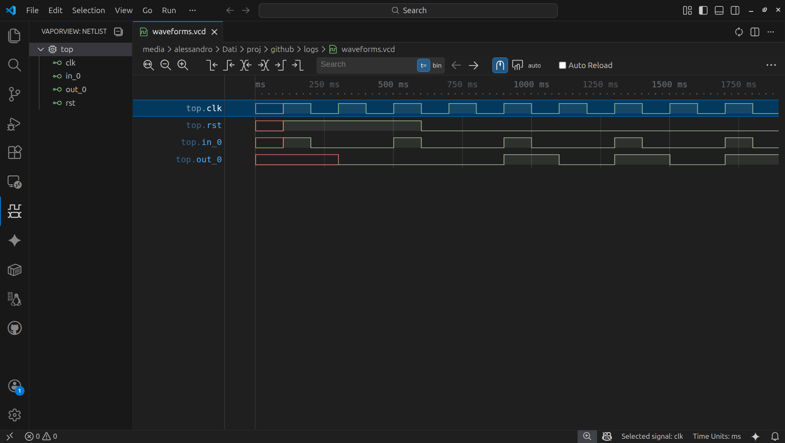
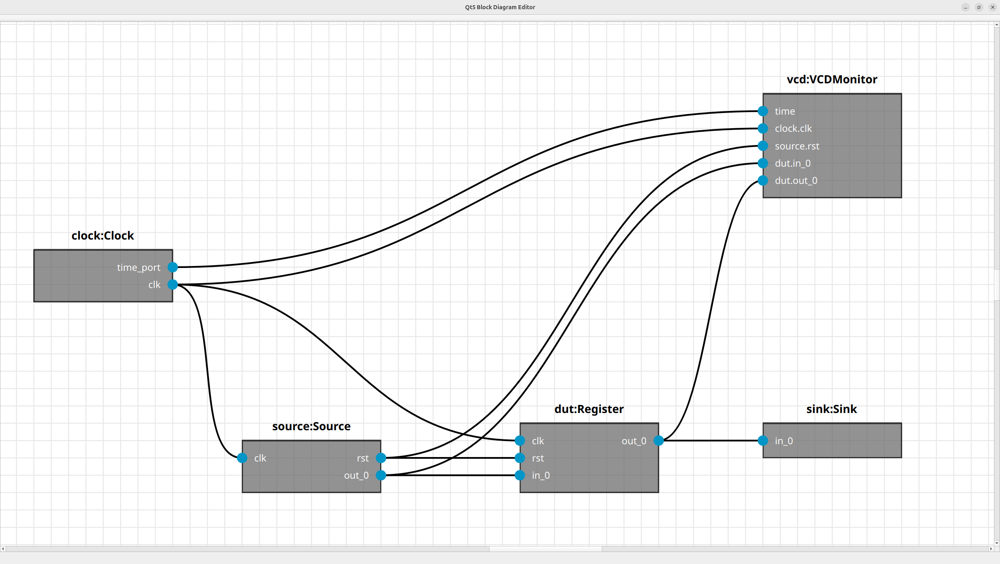

- [openformatproj/me (Modeling Environment)](#openformatprojme-modeling-environment)
  - [Introduction](#introduction)
  - [Domains and Parts](#domains-and-parts)
    - [Hardware](#hardware)
      - [Digital](#digital)
  - [Demos](#demos)
    - [RTL](#rtl)
      - [Register](#register)
        - [Definition](#definition)
        - [Simulation](#simulation)
        - [Visualization](#visualization)
        - [Code Generation](#code-generation)
- [Tags](#tags)
- [Improvement Areas](#improvement-areas)
- [Contributing](#contributing)
  - [Ways to Contribute](#ways-to-contribute)
  - [Contribution Workflow](#contribution-workflow)
  - [Contributor Acknowledgment](#contributor-acknowledgment)
- [License](#license)

# openformatproj/me (Modeling Environment)

This engine integrates the [`ml`](https://openformatproj.github.io/ml-docs/) framework and [`diagrams`](https://github.com/openformatproj/diagrams) tool to expose a functional environment where these two components interact seamlessly. Moreover, it defines a collection of domains and parts meant to be used to create complex and heterogeneous systems.

## Introduction

The `me` project serves as a bridge between abstract modeling, simulation, visualization, and implementation. It provides domain-specific libraries (such as digital hardware) and tools to visualize system architectures or generate target code (like VHDL) from Python-based behavioral descriptions. It also handles a more advanced configuration management and attributes propagation.

## Domains and Parts

### Hardware

#### Digital

The framework includes support for modeling digital logic.

-   **Logic Types**: VHDL `std_logic` or Verilog `logic` equivalent (`Logic` enum with '0', '1', 'X', 'Z', etc.).
-   **Code Generation**: Automatic generation of VHDL entity and architecture from Python `Part` definitions using template-based generation and LLM integration (Gemini).
-   **Monitoring**: `@vcd_monitor` for generating Value Change Dump (VCD) files compatible with waveform viewers like GTKWave.

## Demos

These demos show how it is possible to simulate and test domain-specific parts and to generate the corresponding implementations (VHDL, Verilog/SystemVerilog, SystemC...).

### RTL

These demos deal with the RTL (Register Transfer Level) domain.

This modeling environment is usually better than domain-specific tools because:
-   **System Integration**: A domain-specific part defined with the `ml` framework can be integrated in broader and more generic systems and simulations, like for instance a [multirotor](https://github.com/openformatproj/multirotor), allowing hardware-in-the-loop style validation against physics models.
-   **Feature Richness**: The Python environment has more features than standard domain-specific testbenches, enabling seamless use of libraries for signal processing, AI, and data visualization within the simulation.
-   **Abstraction**: In `me`, a `Part` is a generic abstraction. It can represent a logic gate, a mechanical linkage, or a network packet processor. This allows for **heterogeneous simulations** that are difficult to achieve with pure domain-specific tools.

Compared to alternatives like **MyHDL**, **PyVHDL**, and **Cocotb**:
-   **Scope**: MyHDL and PyVHDL target RTL design and verification, while Cocotb focuses on verification using external simulators. `me` targets **System-Level Engineering**, allowing you to simulate a digital hardware component (like a FFT) connected directly to a physics model or a software algorithm within the same execution loop.
-   **Simulation Engine**: `me` utilizes the `ml` framework's hybrid **event-driven and synchronous dataflow** engine, supporting multi-threaded and multi-process execution strategies. This contrasts with the generator-based, single-threaded kernels typical of Python HDL simulators, enabling higher performance for complex, mixed-domain systems.

Consider, however, that a RTL `Part` corresponds and maps to a single VHDL/Verilog process. For multi-process designs, you must instantiate multiple `Part`s and wire them together manually. This aspect arises from the generalistic nature of `ml`.

#### Register

This demo (`demos/rtl/register.py`) shows how it's possible to define a RTL part using `ml`, simulate it through a testbench, generate waveforms, view the testbench diagram, and even generate the corresponding VHDL code.

##### Definition

The register is defined as a `Part` with input/output ports and a behavior method decorated to run on clock edges.

```python
class Register(Part):
    """
    A part that behaves like a simple register, updating out_0 with in_0
    whenever the clock port is updated.
    """
    def __init__(self, identifier: str):
        ports = [
            Port('clk', Port.IN, type=Logic, init_value=Logic.U, semantic=Port.PERSISTENT),
            Port('rst', Port.IN, type=Logic, init_value=Logic.U, semantic=Port.PERSISTENT),
            Port('in_0', Port.IN, type=Logic, init_value=Logic.U, semantic=Port.PERSISTENT),
            Port('out_0', Port.OUT, type=Logic, init_value=Logic.U, semantic=Port.PERSISTENT)
        ]
        super().__init__(identifier=identifier, ports=ports, scheduling_condition=all_updated, scheduling_args=('clk',))

    @rising_edge('clk')
    def behavior(self):
        if self.read('rst') == Logic.ONE:
            self.write('out_0', Logic.ZERO)
        else:
            self.write('out_0', self.read('in_0'))
```

**Note on Persistence**: In the digital hardware domain, signals represent physical wires that hold their voltage level until driven to a new value. Therefore, ports are defined as `PERSISTENT`. This ensures that `read()` returns the last known value even if the signal wasn't updated in the current simulation step, mimicking the behavior of a hard-wire which is persistent by nature.

**Note on Scheduling**: The argument `scheduling_condition=all_updated, scheduling_args=('clk',)` mimics the sensitivity list of a hardware process. It ensures the `behavior()` method is only executed when the `clk` signal changes. The `@rising_edge('clk')` decorator then further filters this execution to occur only on the rising edge, implementing standard synchronous logic.

##### Simulation

The testbench wires a stimulus generator `Source` and a sink `Sink` to the DUT.

```python
class Source(Part):
    """
    Generates clock, reset, and input signals for the DUT.
    """
    def __init__(self, identifier: str):
        ports = [
            Port('clk', Port.OUT, type=Logic, init_value=Logic.U, semantic=Port.PERSISTENT),
            Port('rst', Port.OUT, type=Logic, init_value=Logic.U, semantic=Port.PERSISTENT),
            Port('in_0', Port.OUT, type=Logic, init_value=Logic.U, semantic=Port.PERSISTENT),
            Port('time', Port.IN) # Receives time events to advance simulation steps
        ]
        super().__init__(identifier, ports=ports)
        self.cycle = 0

    def behavior(self):
        if self.get_port('time').is_updated():
            self.read('time')

        # Toggle clock
        clk_val = Logic.ONE if self.cycle % 2 == 0 else Logic.ZERO
        self.write('clk', clk_val)

        # Assert reset for the first few cycles
        if self.cycle < 5:
            self.write('rst', Logic.ONE)
        else:
            self.write('rst', Logic.ZERO)

        # Change input data periodically
        if self.cycle % 4 == 0:
            self.write('out_0', Logic.ONE)
        else:
            self.write('out_0', Logic.ZERO)

        self.trace_log(f"Cycle {self.cycle} -> Driving clk={clk_val.value}, rst={self.get_port('rst').peek().value}, in_0={self.get_port('in_0').peek().value}")
        self.cycle += 1

class Sink(Part):
    """
    Consumes the output from the DUT to prevent OverwriteError and verify behavior.
    """
    def __init__(self, identifier: str):
        ports = [
            Port('in_0', Port.IN, type=Logic, init_value=Logic.U, semantic=Port.PERSISTENT)
        ]
        super().__init__(identifier, ports=ports)

    def behavior(self):
        if self.get_port('in_0').is_updated():
            val = self.read('in_0')
            self.trace_log(f"Sink -> Output received = {val.value}")

@vcd_monitor('logs/waveforms.vcd', {
    'clk': 'source.clk',
    'rst': 'source.rst',
    'in_0': 'source.in_0',
    'out_0': 'dut.out_0'
}, time_path='sync.timer_out')
class Testbench(Part):

    def __init__(self, identifier: str):

        event_queues = [EventQueue('timer_q', EventQueue.IN, size=1)]
        
        parts = {
            'sync': EventToDataSynchronizer('sync', 'timer_in', 'timer_out', float),
            'source': Source('source'),
            'dut': Register('dut'),
            'sink': Sink('sink')
        }
        
        super().__init__(identifier, parts=parts, event_queues=event_queues, execution_strategy=Execution.sequential())
        
        # Wire the Timer event to the Synchronizer
        self.wire_event('timer_q', 'sync.timer_in')
        
        # Wire Synchronizer time to Source
        self.wire('sync.timer_out', 'source.time')
        
        # Wire Source signals to DUT
        self.wire('source.clk', 'dut.clk')
        self.wire('source.rst', 'dut.rst')
        self.wire('source.in_0', 'dut.in_0')
        
        # Wire DUT output to Sink
        self.wire('dut.out_0', 'sink.in_0')
```

Thanks to `@vcd_monitor` it's possible to probe signals and create a VCD file to show their waveforms.

<p id="figure-1"/>


<p align="center">Figure 1: Waveforms viewed in a VCD viewer</p>

The simulation is performed by running `simulate()`. <a href="#figure-1">Figure 1</a> shows the outcome of the VCD monitor, if enabled.

##### Visualization

The structure of the testbench can be serialized and visualized using the `diagrams` integration. <a href="#figure-2">Figure 2</a> shows the outcome of executing `view_testbench_diagram()`.

<p id="figure-2"/>


<p align="center">Figure 2: Testbench structure visualization</p>

##### Code Generation

The framework can generate VHDL code by combining Jinja2 templates for the entity definition and LLM calls (e.g., Google Gemini) to translate the Python behavior into VHDL architecture.

```python
vhdl_code = generate_code(
    Register('dut'), 
    language="VHDL", 
    entity_name="register", 
    architecture_name="rtl", 
    llm_client=gemini_client
)
```

Running `generate_vhdl_code(llm=False)` produces the following outcome:

```vhdl
library IEEE;
use IEEE.STD_LOGIC_1164.ALL;

entity register is
    Port (
           clk : in STD_LOGIC;
           rst : in STD_LOGIC;
           in_0 : in STD_LOGIC;
           out_0 : out STD_LOGIC
    );
end register;

architecture rtl of register is
begin

    -- TODO: Implement behavior. Reference Python code:
    --     @rising_edge('clk')
    --     def behavior(self):
    --         if self.get_port('rst').get() == Logic.ONE:
    --             self.get_port('out_0').set(Logic.ZERO)
    --         else:
    --             self.get_port('out_0').set(self.get_port('in_0').get())

end rtl;
```

While running `generate_vhdl_code(llm=True)` produces a complete code:

```vhdl
library IEEE;
use IEEE.STD_LOGIC_1164.ALL;

entity register is
    Port (
           clk : in STD_LOGIC;
           rst : in STD_LOGIC;
           in_0 : in STD_LOGIC;
           out_0 : out STD_LOGIC
    );
end register;

architecture rtl of register is
begin

    -- Generated by gemini-2.5-flash-lite
    process(clk)
    begin
        if rising_edge(clk) then
            if rst = '1' then
                out_0 <= '0';
            else
                out_0 <= in_0;
            end if;
        end if;
    end process;

end rtl;
```

# Tags

`python`, `simulation`, `hardware`, `digital-design`, `rtl`, `vhdl`, `verilog`, `code-generation`, `eda`, `electronic-design-automation`, `component-based`, `MBSE`, `model-based-systems-engineering`, `systems-engineering`

# Improvement Areas

The project is currently in an early stage. While the core engine and the digital domain proof-of-concept are functional, there are significant opportunities for growth:

1.  **Graphical System Design**: Currently, systems are defined in Python code and then visualized. The goal is to enable a **diagram-first workflow**, where users can drag-and-drop parts, connect them graphically, and generate the corresponding Python and HDL code.
2.  **Multi-Language Support**: Extend the code generation capabilities beyond VHDL to support **Verilog**, **SystemVerilog**, and **SystemC**, making the tool adaptable to different industry flows.
3.  **Analog & Mixed-Signal Modeling**: Introduce domains for continuous-time physics and analog electronics (transfer functions, state-space models) to enable true **cyber-physical system (CPS)** simulation.
4.  **Advanced Verification Features**: Implement features inspired by UVM (Universal Verification Methodology), such as constrained random stimulus generation, functional coverage collection, and assertion-based verification.
5.  **Standard IP Library**: Develop a comprehensive library of standard digital components (FIFOs, ALUs, memories) and bus interfaces (AXI, Wishbone) to accelerate design assembly.
6.  **EDA Tool Integration**: Create hooks to automatically launch synthesis, place-and-route, and formal verification tools (e.g., Yosys, Vivado, Quartus) directly from the environment.
7.  **Configuration Management**: Define attributes of Parts and Ports, and propagate and validate configuration attributes across the hierarchy of sub-systems and connections.

# Contributing

We warmly welcome contributions to enhance this framework! Whether you're fixing a bug, adding a new feature, improving documentation, or suggesting new ideas, your input is valuable.

## Ways to Contribute

*   **Bug Reports**: If you find a bug, please open an issue detailing the problem, steps to reproduce, and your environment.
*   **Feature Requests**: Have an idea for a new feature or an improvement to an existing one? Open an issue to discuss it.
*   **Code Contributions**: Implement new features, fix bugs, or refactor code. See the [Improvement Areas](#improvement-areas) for inspiration.
*   **Documentation**: Improve code comments or add other explanatory documents.
*   **Testing**: Add or improve unit tests, integration tests, or simulation scenarios.

## Contribution Workflow

If you'd like to contribute code or documentation, please follow these general steps:

1.  **Discuss (for major changes)**: For significant changes (e.g., new core features, large refactors), please open an issue first to discuss your ideas. This helps ensure your efforts align with the project's direction and avoids duplicate work.
2.  **Fork the Repository**: Create your own fork of the project on GitHub.
3.  **Create a Branch**: Create a new branch in your fork for your feature or bug fix.
    ```bash
    git checkout -b your-descriptive-branch-name
    ```
4.  **Make Your Changes**: Implement your changes, adhering to any existing code style if possible.
5.  **Test Your Changes**: Ensure your changes work as expected and do not introduce new issues.
6.  **Commit Your Changes**: Write clear, concise commit messages.
7.  **Push to Your Fork**: Push your changes to your branch on your fork.
    ```bash
    git push origin your-descriptive-branch-name
    ```
8.  **Submit a Pull Request (PR)**: Open a pull request from your branch to the `master` (or main development) branch of the original repository. Provide a clear title and a detailed description of your changes, referencing any relevant issues.

## Contributor Acknowledgment

To ensure proper credit is given, here are some guidelines:

- **Acknowledgment**: Major contributors may be acknowledged in this section or other relevant parts of the documentation.
- **Commit History**: All contributions will be visible in the commit history of the repository.
- **Pull Request Description**: Please include your name or preferred alias in the pull request description if you'd like to be credited.
- **Issues and Discussions**: Active participation in issue discussions, providing feedback, and helping others are also valuable forms of contribution and may be acknowledged.

# License


This project is licensed under the [Apache License 2.0](https://www.apache.org/licenses/LICENSE-2.0). You are free to use, modify, and distribute this software, provided that you include proper attribution to the original author(s). Redistribution must retain the original copyright notice and this license.